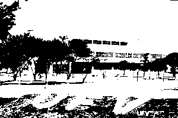
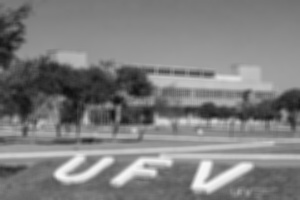
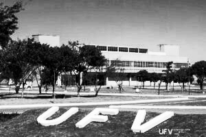
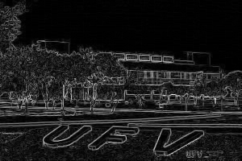

# Processador de Imagens Simples

[](LICENSE)
[](https://www.python.org/)
[]()

Uma aplicação com interface gráfica (GUI) para processamento básico de imagens, criada para cumprir os requisitos do projeto da disciplina SIN 392 - Introdução ao Processamento Digital de Imagens da UFV.

O projeto é estruturado de forma modular, separando a interface gráfica da lógica de processamento de imagens.

## Bibliotecas Utilizadas

-  [Pillow](https://python-pillow.org/)
-  [NumPy](https://numpy.org/)
-  [Matplotlib](https://matplotlib.org/)
-  (nativo do Python)

## Estrutura dos Arquivos

- `main.py`: Arquivo principal da aplicação, contendo a interface em Tkinter e o controle dos eventos.
- `operacoes_histograma.py`: Lógica para o cálculo e exibição do histograma.
- `transformacoes_intensidade.py`: Lógica para alargamento de contraste e equalização.
- `filtros_espaciais.py`: Lógica para filtros espaciais passa-baixa e passa-alta.
- `dominio_frequencia.py`: Lógica para operações baseadas em Fourier.
- `operacoes_morfologicas.py`: Lógica para erosão e dilatação.
- `operacoes_segmentacao.py`: Lógica para a limiarização de Otsu.
- `requirements.txt`: Dependências do projeto.

## Requisitos

Para executar esta aplicação, você precisa do Python 3 e das bibliotecas listadas no arquivo `requirements.txt`.

Você pode instalar todas as dependências executando:

```bash
pip install -r requirements.txt
```

## Exemplos Visuais

A imagem é automaticamente convertida para tons de cinza ao ser carregada:

| Original                    | Escala de Cinza                            |
| --------------------------- | ------------------------------------------ |
|  |  |

### Exemplos de Operações

| Otsu (Segmentação)       | Média (Filtro)             | Equalização do Histograma              | Detecção de Bordas (Roberts)   |
| ------------------------ | -------------------------- | -------------------------------------- | ------------------------------ |
|  |  |  |  |

## Como Executar

1. Clone este repositório ou baixe os arquivos para um único diretório.
2. Instale as bibliotecas necessárias usando o comando acima.
3. Execute o arquivo principal da aplicação:

```bash
python main.py
```

## Exemplo de Uso

```bash
python main.py
```

1. Clique em **"Carregar Imagem"** para abrir um arquivo de imagem. Ela será automaticamente convertida para tons de cinza.
2. A imagem original aparecerá à esquerda, e a imagem a ser processada, à direita.
3. Clique em qualquer um dos botões de função no painel esquerdo para aplicar um efeito. O resultado será exibido no painel direito. Todas as operações são aplicadas sobre a imagem original para evitar efeitos cumulativos e o usuário pode verificar a qualquer momento o histograma da imagem processada clicando em **"Exibir Histograma"**.
4. Para salvar seu trabalho, clique em **"Salvar Imagem Processada"**.
5. Clique em **"Resetar Imagem"** para descartar as alterações na imagem processada.

## Licença

Este projeto está licenciado sob a licença MIT. Veja o arquivo [LICENSE](LICENSE) para mais detalhes.
